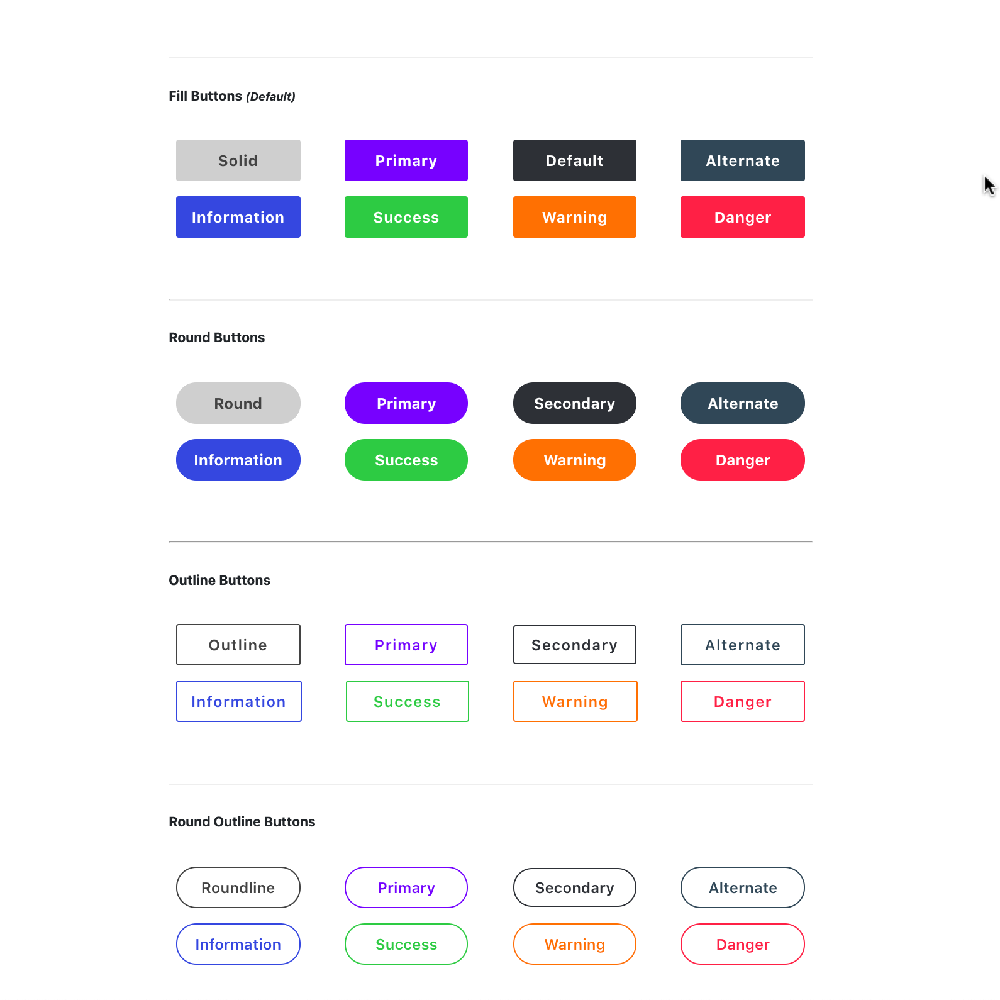

<style>
h1 {
line-height: 1 !important;
margin: 1em 0.125rem auto !important;
padding-bottom: 0 !important;
text-align: center;
}
h1 small {
font-size: small;
line-height: 1 !important;
margin: 0 !important;
font-weight: normal;
}
header h4 {
line-height: 1.5;
font-style: italic;
margin: 1em auto -1rem auto;
padding: 0;
text-align: left;
color: mediumblue;
opacity: 0.45;
font-weight: 400;
letter-spacing: 1px;
}
[role=banner] {
background-color: ghostwhite;
padding: 1em;
border-radius: 4px;
}
.header-subtitle {

margin: 1rem auto;
text-align: center;
width: 45%;
}
</style>


<header role="banner"><h1>Sass Button Builder <small><br>`sass-button-builder`</small></h1> <div class="header-subtitle"><h4>SCSS Mixins To Facilitate The Efficient Sytling Of Buttons and distributed as an NPM package.<h4></div> </header>


## Overview

### Description

Lorem ipsum dolor sit amet, consectetur adipisicing elit, sed do eiusmod tempor incididunt ut labore et dolore magna aliqua. Ut enim ad minim veniam, quis nostrud exercitation ullamco laboris nisi ut aliquip ex ea commodo consequat.


## Installation

### 1. Get the code into your project using a package manager.
#### If you're using NPM, run the following from the commandline:

```sh
npm install sass-button-builder --save
npm install
```


##### If you're using Yarn, run:

```sh
yarn add sass-button-builder
```

### 2. Import the main Scss partial somewhere in your stylesheets

##### Do so with:

```scss
@import('PATH_T0_PROJECT_ROOT/node_modules/sass-button-builder/sass-button-builder.scss');
```

> *Inside your main or 'master' stylesheet is generally a good default location*
> *(for example, `myproject/app/stylesheets/main.scss`).*
> 
> *A Scss partial holding all 3rd-party code, plugins, or vendor packages is also common*
> *(often someting like, `myproject/src/styles/lib/_vendor.scss`).*


## Usage

### `Main Mixins`
***File Location:***
`sass-button-builders/button-builder.scss`

***Create Solid Button***

```scss
/**
 * Creates a solid button of a supplied fill color with slightly-rounded corners.
 * 
 * @param:      $_color     HEX/HSL/RGB(a) value, unquoted CSS-Color string-identifier
 *                          (DEFAULT : $default-button-color)
 *                          
 * @example:    .my-button { @include solidButton(mediumslateblue); }
 *              .my-other-button { @include solidButton(#333333); }
**/
@mixin solidButton($_color: $button-color--default) { ... }
```

***Create Round Button***

```scss
/**
 * Creates a rounded button of a supplied fill color with fully-rounded, oval corners.
 * 
 * @param:      $_color     HEX/HSL/RGB(a) value, unquoted CSS-Color string-identifier
 *                          (DEFAULT : $default-button-color)
 *                          
 * @example:    .my-button { @include roundButton(mediumslateblue); }
 *              .my-other-button { @include roundButton(#333333); }
**/
@mixin roundbutton($_color: $button-color--default) { ... }
```


***Create Outline Button***

```scss
/**
 * Creates a outlined button of supplied text- and border-color with slightly-rounded corners.
 * 
 * @param:      $_color     HEX/HSL/RGB(a) value, unquoted CSS-Color string-identifier
 *                          (DEFAULT : $default-button-color)
 *                          
 * @example:    .my-button { @include outlineButton(mediumslateblue); }
 *              .my-other-button { @include outlineButton(#333333); }
**/
@mixin outlineButton($_color: $button-color--default) { ... }
```

### Mixing These Styles

#### Rounded Outline Button
```scss
.round {
    @include roundButton();
    &.outline {
        @include outlineButton();
    }
}
// or ...
.round.outline {
    @include roundButton();
    @include outlineButton();
}
```

### Color Classes

#### Add these classes to automatically adjust the color

```scss
.primary {...}
.secondary {...}
.danger {...}
.warning {...}
.success {...}
.alternate {...}
.info {...}

```

### A Note On Semantics
This project's aim was to enable button creation with the fewest possbile implementation steps and cleanest / most semantic markup.
Thus, the preference is to write markup as such:

```html
<button role="button">Default</button>

<button role='button' class='primary'>Primary</button>

<button role="button" class="round">Default</button>

<button role='button' class='outline danger'>Outline</button>

<!-- No need to add `.button` class, as `role="button"` is more effective -->
<a role="button">Button-Style Link</a>

<!-- No need to add `.button` class, as `role="button"` is more effective, -->
<!-- but `type="button"` is still a good idea. --> 
<input role="button" type="button" class="outline secondary">Button-Style Input />

<!-- No need to add `.button` class, as `role="button"` is more effective, -->
<!-- but `type="button"` is still a good idea. --> 
<input role="button" type="submit" class="round primary">Button-Style Submit />

<button role='button' class='round outline success'>Success</button>
```


### Variables, Settings, and Configurations
#### File Locations:
`sass-button-builders/core/_variables.scss`
`sass-button-builders/core/_config.scss`
`sass-button-builders/core/_settings.scss`


## Images
##### Screenshots



